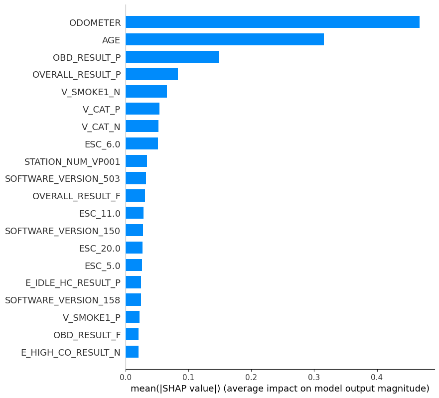

## train the model

to train the model:

- cd into the code directory

`cd code`

- in a python shell, do:

```bash
from prepare_dataset import Preparer
prep = Preparer('../data/', 'sample_data.csv')
data = prep.make_train_test_data()
from train_model import ModelTrainer
model = ModelTrainer(data)
model.train_model()
```

this will produce the datasets and the trained model

we used the `shap` package to plot the model's feature importance.
unfortunately there is a small bug in the current shap version.
the fix is described [here](https://github.com/slundberg/shap/commit/dab40944bbb5382c10b9bdc46b9176144764dfa6)

if the bug is fixed, you can plot the features:

```bash
from plot_features import plot_features
plot_features(model.clf, prep.df, '../plots/')
```

this will save these two plots in the `plots` directory:

 
